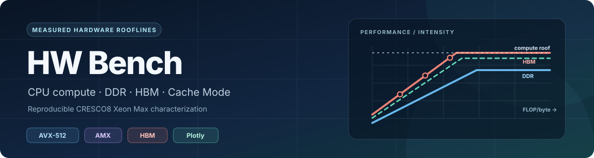

<div align="center">



<h1>HW Bench</h1>

<p>
  
  
  
  
</p>

**A reproducible, measured CPU + DDR + HBM Roofline study.**

[Quick start](#quick-start) · [Measured results](#measured-results) ·
[Documentation](#documentation) · [Repository map](#repository-map)

</div>

---

HW Bench owns the *hardware-only* experiments: sustainable STREAM-model Triad
bandwidth, AVX-512 FP32/FP64 and verified AMX BF16/INT8 throughput, a measured
FP64 intensity sweep, Cache versus Flat memory behavior, and one- versus
two-socket scaling. LLM inference workloads belong in
[LLM Bench](https://github.com/struggling-student/benchmark).

The current campaign measures two Intel Xeon CPU Max 9480 sockets on CRESCO8.
Flat Mode exposes local DDR and HBM as separate NUMA targets. Cache Mode hides
HBM behind DDR, so its bandwidth is reported only as **effective bandwidth at
a stated working-set size**. The project never changes firmware memory mode.

## Quick start

Install the local analysis tools:

```bash
git clone https://github.com/struggling-student/hw-bench.git
cd hw-bench
python3 -m venv .venv
source .venv/bin/activate
python -m pip install -r requirements.txt
pytest -q
```

The [executed notebook](notebooks/roofline_analysis.ipynb) can be read immediately.
To **rerun** it, first place the two complete campaigns in the git-ignored
`data/raw/cache/` and `data/raw/flat/` directories, then run:

```bash
./scripts/make_analysis.sh
```

That command normalizes and validates the raw records, regenerates the 14
standalone interactive HTML figures and summary JSON, and executes the notebook
entirely from local files. For PNG previews, install Kaleido with a compatible
browser and set `HW_BENCH_EXPORT_PNG=1` before the command. The
[run-and-retrieve guide](docs/02_RUN_AND_RETRIEVE.md) explains how to collect
new data on authorized compute nodes; **do not run the campaigns on a login node**.

## Measured results

| Full-core path | One socket | Two sockets |
| --- | ---: | ---: |
| Flat HBM Triad | 559.6 GB/s | 1,226.2 GB/s |
| Flat DDR Triad | 235.5 GB/s | 469.9 GB/s |
| AVX-512 FP64 | 4.13 TFLOP/s | 8.24 TFLOP/s |
| AVX-512 FP32 | 8.26 TFLOP/s | 16.47 TFLOP/s |
| AMX BF16 | 27.59 TFLOP/s | 54.66 TFLOP/s |
| AMX INT8 | 218.44 TOPS | 434.45 TOPS |

Flat HBM delivered **2.38×** the matched Flat DDR Triad bandwidth per socket.
Cache Mode delivered **530.5 GB/s** with a 16 GiB/socket working set and
**193.5 GB/s** at 96 GiB/socket. Four-panel one- and two-socket Rooflines
combine every measured compute path with four measured memory cases while
keeping FLOP and integer OP units separate. The interactive HTML files are
generated locally in `figures/` and git-ignored; the executed notebook embeds
the figures. Only FP64 has measured intensity-sweep points.

## Documentation

The [documentation index](docs/README.md) is the table of contents for the
complete study:

| Guide | Read it for |
| --- | --- |
| [01 — Scope and topology](docs/01_SCOPE_AND_TOPOLOGY.md) | Hardware/LLM Bench boundary, discovered NUMA mapping, and mode semantics |
| [02 — Run and retrieve](docs/02_RUN_AND_RETRIEVE.md) | Setup, compute-node campaigns, private site config, and offline rebuild |
| [03 — Methods and data](docs/03_METHODS_AND_DATA.md) | Kernels, affinity, working sets, raw/processed schema, statistics, and equations |
| [04 — Analysis and results](docs/04_ANALYSIS_AND_RESULTS.md) | Plot guide, measured ceilings, knees, theory, and interpretation |
| [Validation appendix](docs/VALIDATION.md) | Preserved failed/superseded runs and acceptance criteria |

## Repository map

| Path | Contents |
| --- | --- |
| `benchmarks/` | Native Triad, AVX-512, AMX, and intensity kernels plus oneDNN driver |
| `scripts/` | Discovery, build, campaigns, retrieval, processing, and notebook generation |
| `src/hwbench/` | Topology, record parsing, validation, statistics, and Plotly figures |
| `notebooks/` | Executed thesis-facing Roofline analysis |
| `data/raw/`, `data/processed/` | Local, git-ignored complete logs and normalized results |
| `figures/` | Local, git-ignored self-contained HTML and optional PNG figures |
| `third_party/stream/` | Original STREAM source and provenance; Intel MLC is not vendored |

## Theoretical sources

Theory is shown separately from empirical ceilings. The model uses the detected
core count and an explicit base-clock assumption; maximum turbo is only an
upper clock reference, not an all-core AVX-512/AMX guarantee. Primary sources:

- [Intel Xeon CPU Max 9480 specifications](https://www.intel.com/content/www/us/en/products/sku/232592/intel-xeon-cpu-max-9480-processor-112-5m-cache-1-90-ghz/specifications.html)
- [Intel Xeon Scalable Processor Max technical overview](https://www.intel.com/content/www/us/en/developer/articles/technical/xeon-scalable-processor-max-series.html)
- [Intel Architecture Day operations-per-cycle material](https://download.intel.com/newsroom/2021/client-computing/intel-architecture-day-2021-presentation.pdf)
- [Intel Xeon CPU Max configuration and tuning guide](https://cdrdv2-public.intel.com/782255/354227-intel-xeon-cpu-max-series-configuration-and-tuning-guide-1.pdf)
